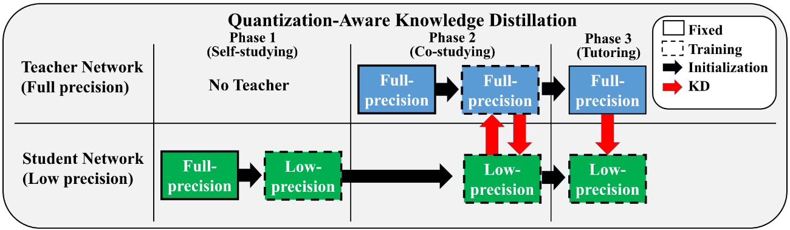
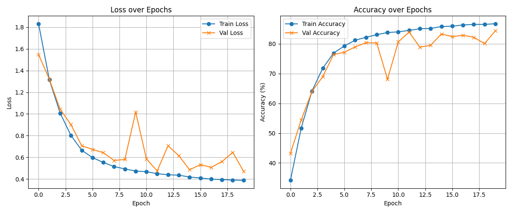

# Quantization-Aware Knowledge Distillation (QKD) on CIFAR-10

This repository contains code and experiments for **Quantization-Aware Knowledge Distillation (QKD)** using a ResNet-18 backbone on the CIFAR-10 dataset. The goal is to distill knowledge from a full-precision teacher network into a quantized student network.


## Overview




- **Teacher Model**: Full-precision ResNet-18
- **Student Model**: Quantized ResNet-18 (varied bit-widths)
- **Dataset**: CIFAR-10

## Setup

```bash
pip install -r requirements.txt
```

## Training

```bash
python train_qkd.py --teacher-path ./weights/resnet18_teacher.pth --bits 4
```

## Experiments results


